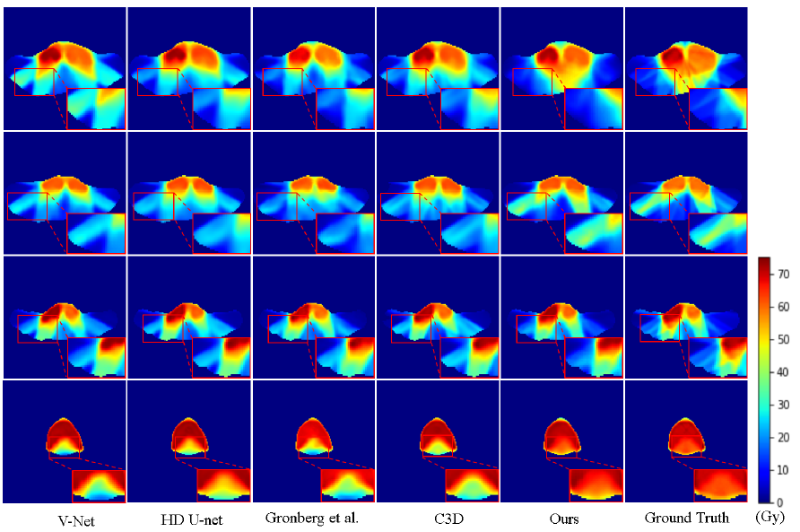

# BeamDosePrediction
[[`Paper`](https://link.springer.com/chapter/10.1007/978-3-031-16449-1_55)] [[`BibTeX`](#citing)]
This is the implementation of our paper **"Deep learning-based Head and Neck Radiotherapy Planning Dose Prediction via Beam-wise Dose Decomposition"** published in **MICCAI 2022**.

## News

Our extended journal paper, "Beam-wise dose composition learning for head and neck cancer dose prediction in radiotherapy", has already been published on Medical Image Analysis, 2024. 
[[`Paper`](https://www.sciencedirect.com/science/article/pii/S1361841523003055)] [[`Code`](https://github.com/TL9792/BDCLDosePrediction)] [[`BibTeX`](#citing)]


## Abstract

Accurate dose map prediction is key to external radiotherapy. Previous methods have achieved promising results; however, most of these methods learn the dose map as a black box without considering the beam-shaped radiation for treatment delivery in clinical practice. The accuracy is usually limited, especially on beam paths. To address this problem, this paper describes a novel "disassembling-then-assembling" strategy to consider the dose prediction task from the nature of radiotherapy. Specifically, a global-to-beam network is designed to first predict dose values of the whole image space and then utilize the proposed innovative beam masks to decompose the dose map into multiple beam-based sub-fractions in a beam-wise manner. This can disassemble the difficult task to a few easy-to-learn tasks. Furthermore, to better capture the dose distribution in region-of-interest (ROI), we introduce two novel value-based and criteria-based dose volume histogram (DVH) losses to supervise the framework. Experimental results on the public OpenKBP challenge dataset show that our method outperforms the state-of-the-art methods, especially on beam paths, creating a trustable and interpretable AI solution for radiotherapy treatment planning.


## Results

* Visualization of our results and some comparisons with other methods. 




* Our algorithm has been evaluated on the public Dataset OpenKBP and we achieve the state-of-the-art quantitative results as follows:

| Dose score | DVH score |
| :--------: | :-------: |
|   2.276    |   1.257   |


## Citing

```
@inproceedings{wang2022deep,
  title={Deep Learning-Based Head and Neck Radiotherapy Planning Dose Prediction via Beam-Wise Dose Decomposition},
  author={Wang, Bin and Teng, Lin and Mei, Lanzhuju and Cui, Zhiming and Xu, Xuanang and Feng, Qianjin and Shen, Dinggang},
  booktitle={International Conference on Medical Image Computing and Computer-Assisted Intervention},
  pages={575--584},
  year={2022},
  organization={Springer}
}

@article{teng2024beam,
  title={Beam-wise dose composition learning for head and neck cancer dose prediction in radiotherapy},
  author={Teng, Lin and Wang, Bin and Xu, Xuanang and Zhang, Jiadong and Mei, Lanzhuju and Feng, Qianjin and Shen, Dinggang},
  journal={Medical Image Analysis},
  volume={92},
  pages={103045},
  year={2024},
  publisher={Elsevier}
}
```


## contact
You are welcome to contact us:
  - [ukaukaaaawang@gmail.com](mailto:ukaukaaaawang@gmail.com)

